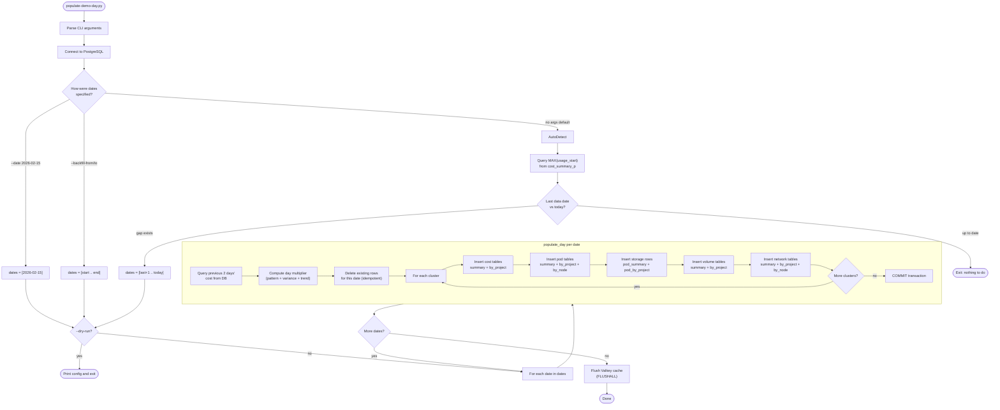
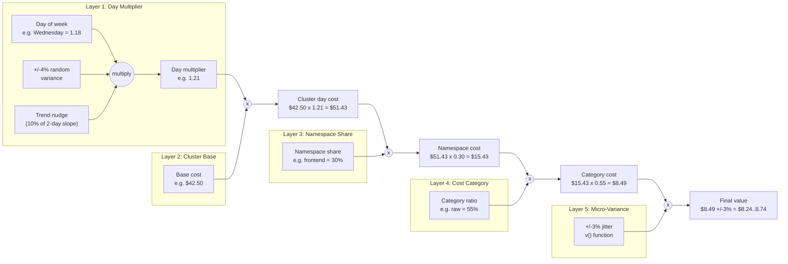
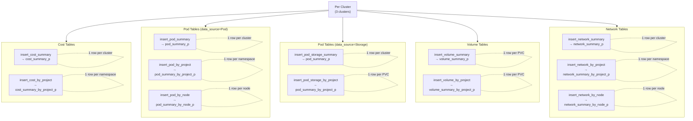

# Data Generation Logic

This document explains how `scripts/populate-demo-day.py` generates synthetic
cost and usage data. The logic is layered: a day-level multiplier drives the
overall magnitude, then static configurations distribute values across clusters,
namespaces, nodes, and cost categories. Small random variance is applied at each
level to prevent the data from looking artificially flat.

## Overview

The generator produces data for **3 clusters x 10 summary tables** per day.
Each day's values are derived from:

1. A **weekly traffic pattern** (deterministic)
2. A **random daily variance** (+/-4%)
3. A **trend nudge** from the previous 2 days' actual data
4. **Fixed base values** per cluster (cost, CPU, memory, network)
5. **Fixed shares** per namespace and node
6. **Fixed ratios** for cost categories
7. **Micro-variance** (+/-3%) on individual fields

The result is ~90% deterministic data with enough jitter to look organic in
charts, but no simulation of real-world events like incidents, scaling, or
seasonal trends.

## Execution Flow

The following diagram shows the end-to-end execution of the script, from
startup through date resolution, data generation, and cache flush.



## Value Computation Flow

This diagram shows how a single numeric value (e.g. a namespace's raw cost)
is derived through the layered computation. Each layer feeds into the next.



## Table Insert Map

Each cluster generates rows across 10 tables per day. This diagram shows
which insert functions write to which tables and what dimensions they break
down by.



## Layer 1: Day Multiplier

Every day gets a single multiplier applied uniformly to all clusters. It
combines three components.

### Weekly pattern (deterministic)

A fixed day-of-week multiplier creates a repeating weekly shape:

| Day | Multiplier | Character |
|-----|-----------|-----------|
| Monday | 1.05 | Ramp-up after weekend |
| Tuesday | 1.12 | Building to peak |
| Wednesday | 1.18 | Mid-week peak |
| Thursday | 1.10 | Sustain |
| Friday | 0.92 | Wind-down |
| Saturday | 0.48 | Weekend low |
| Sunday | 0.52 | Weekend low |

This means Wednesday is always the most expensive day and Saturday is always
the cheapest. The pattern repeats identically every week.

### Random variance

A uniform random value in the range [-0.04, +0.04] is added. This shifts the
day's total by up to +/-4% from the weekly pattern alone.

### Trend nudge

If the database contains data for the previous 2 days, the script computes the
slope between them and adds 10% of that trend to the variance. This creates a
slight momentum effect: if costs were rising over the last 2 days, today is
slightly more likely to continue rising, and vice versa.

### Final multiplier

```
multiplier = weekly_pattern[day_of_week] * (1 + random_variance + trend_nudge)
```

All clusters share the same multiplier for a given day. There is no
per-cluster day-level variance.

## Layer 2: Cluster Base Values

Each cluster has static base values that define its scale:

| Value | Production | Development | Staging |
|-------|-----------|-------------|---------|
| Base cost/day | $42.50 | $18.20 | $12.80 |
| Base CPU (core-hours) | 28.0 | 12.0 | 8.5 |
| Base memory (GiB-hours) | 56.0 | 24.0 | 17.0 |
| Pod count | 24 | 18 | 10 |
| CPU capacity (core-hours) | 384.0 | 192.0 | 192.0 |
| Memory capacity (GiB-hours) | 1536.0 | 768.0 | 768.0 |
| Base network in (GB) | 12.0 | 5.0 | 3.0 |
| Base network out (GB) | 3.5 | 1.5 | 0.8 |

A day's actual value for any metric is `base_value * day_multiplier`. The
relative proportions between clusters are constant (Production is always ~2.3x
Development, etc.).

## Layer 3: Namespace and Node Distribution

Within each cluster, resources and costs are distributed using fixed percentage
shares. These never vary.

### Production Cluster

| Namespace | Cost | CPU | Memory | Network |
|-----------|------|-----|--------|---------|
| frontend | 30% | 30% | 25% | 35% |
| backend-api | 25% | 25% | 25% | 30% |
| database | 22% | 20% | 28% | 10% |
| monitoring | 13% | 15% | 12% | 15% |
| redis-cache | 10% | 10% | 10% | 10% |

### Development Cluster

| Namespace | Cost | CPU | Memory | Network |
|-----------|------|-----|--------|---------|
| dev-workspace | 35% | 35% | 30% | 25% |
| ci-cd | 30% | 30% | 30% | 35% |
| code-review | 20% | 20% | 25% | 25% |
| testing | 15% | 15% | 15% | 15% |

### Staging Cluster

| Namespace | Cost | CPU | Memory | Network |
|-----------|------|-----|--------|---------|
| staging-app | 45% | 45% | 45% | 40% |
| load-testing | 35% | 35% | 35% | 40% |
| qa-validation | 20% | 20% | 20% | 20% |

### Node distribution

All three clusters distribute load across their nodes using fixed shares:

| Node | Share |
|------|-------|
| worker-1 | 45% |
| worker-2 | 35% |
| worker-3 | 20% |

## Layer 4: Cost Decomposition

Total cost for a cluster or namespace is split into accounting categories using
fixed ratios. These are applied identically everywhere:

| Category | Ratio | Description |
|----------|-------|-------------|
| Infrastructure raw cost | 55% | Base compute charges |
| Infrastructure markup | 8.25% | 15% markup on raw cost |
| Infrastructure usage (CPU) | 10% | CPU-based metered cost |
| Infrastructure usage (memory) | 5% | Memory-based metered cost |
| Supplementary (CPU) | 14% | Supplementary CPU charge |
| Supplementary (memory) | 10% | Supplementary memory charge |
| Supplementary (volume) | 2% | Supplementary volume charge |
| Cost model (CPU) | 24% | Cost model CPU rate |
| Cost model (memory) | 15% | Cost model memory rate |
| Cost model (volume) | 2% | Cost model volume rate |

The ratio between cost categories is constant. If raw cost is $27.58 on a given
day, markup is always $27.58 * 0.15 = $4.14.

## Layer 5: Micro-Variance

A helper function `v()` applies +/-3% uniform random noise to individual field
values at insert time:

```python
def v(base: float, variance_pct: float = 0.03) -> float:
    return round(base * (1 + random.uniform(-variance_pct, variance_pct)), 4)
```

This is applied to nearly every numeric field in every INSERT. It prevents
identical-looking values across rows but does not create meaningful
differentiation between clusters or namespaces. The noise is cosmetic.

## Layer 6: Usage Metrics

CPU and memory usage values have their own random bands, applied per row:

| Metric | Range | Notes |
|--------|-------|-------|
| CPU usage | 60-80% of (base * multiplier) | Same range for all clusters/namespaces |
| Memory usage | 70-90% of (base * multiplier) | Same range for all clusters/namespaces |
| CPU request | 100% of (base * multiplier) | Always equals the base scaled value |
| CPU limit | 140% of request | Fixed headroom |
| Memory request | 100% of (base * multiplier) | Always equals the base scaled value |
| Memory limit | 130% of request | Fixed headroom |
| Volume usage | 40-75% of capacity | Per-PVC random fraction |
| Volume request | 90% of capacity / 30 | Fixed, converted to monthly rate |

## Layer 7: Volume and Network Pricing

### Volumes

Each PVC has a static capacity in GiB, a storage class, and a count. Daily cost
is derived from a fixed price:

```
daily_cost = capacity_gib * $0.10/GiB/month / 30
```

Volume costs are not affected by the day multiplier. They are constant day to
day (modulo the +/-3% micro-variance).

### Network

Network data volumes scale with the day multiplier:

```
data_in  = base_net_in  * day_multiplier
data_out = base_net_out * day_multiplier
```

Network cost is computed at a flat rate of ~$0.05/GB for raw cost, with 15%
markup applied on top.

## Randomness Summary

| Aspect | Deterministic or random? | Notes |
|--------|--------------------------|-------|
| Which day is expensive vs. cheap | Deterministic | Wednesday peak, Saturday trough |
| How much a specific day deviates | +/-4% random + trend | Small variance |
| Relative cost across clusters | Deterministic | Production is always ~2.3x Development |
| Namespace shares within a cluster | Deterministic | Fixed percentages, never vary |
| Cost category breakdown | Deterministic | Fixed ratios |
| Individual field values | +/-3% random | Cosmetic jitter |
| CPU utilization | Random, 60-80% band | Same band for all contexts |
| Memory utilization | Random, 70-90% band | Same band for all contexts |
| Volume utilization | Random, 40-75% band | Per-PVC, independent |
| Volume cost | Deterministic | Capacity-based, no day multiplier |
| Network volumes | Scales with day multiplier | Same pattern as cost |

## Implications

- Every week looks essentially the same in the UI, shifted by small jitter.
- There are no simulated events (deployments, incidents, autoscaling, seasonal
  changes, month-end spikes, etc.).
- Namespace proportions within a cluster are constant, so "top namespace" views
  will always show the same ranking.
- All clusters follow the same daily curve since they share one multiplier.
